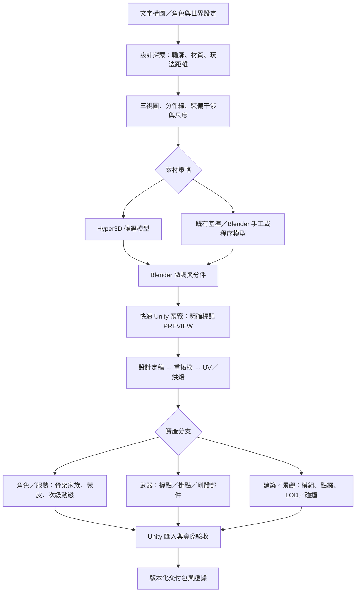

# MMO Asset Pipeline · Asset Forge

從構圖文字與概念設計，製作可在 **Unity MMORPG** 使用的角色、服裝、武器、建築、景觀與場景。Hyper3D 負責生成候選幾何；Blender 負責設計修正、重拓樸、UV／烘焙、骨架、蒙皮及動畫；Unity 負責實際匯入、換裝、材質、動作與效能驗收。

**目前版本：workflow 與可執行的前置規畫／檢查工具。尚未完成付費生成、自動蒙皮、Unity 外掛或完整端到端資產交付。** 附件方案名稱 `mmo-asset-forge` 保留為 Asset Forge 概念，GitHub 目的地維持 `monkey1sai/mmo-asset-pipeline`。



流程與美術彈性：[workflow](docs/workflow.md)、[角色／換裝契約](docs/character-and-wardrobe.md)、[材質／場景規範](docs/materials-and-environments.md)、[快速迭代](docs/iteration.md)、[Hyper3D adapter](docs/hyper3d.md)。來源與實作界線見 [sources](docs/sources.md) 及 [驗收](docs/acceptance.md)。

## 本地使用

工具只需 Python 3.10+，不自動安裝、上傳或消耗 credits。

```powershell
python tools/pipeline.py check-brief examples/character.json
python tools/pipeline.py plan examples/character.json --out artifacts/plans/character.json
python tools/pipeline.py plan examples/building.json --out artifacts/plans/building.json
python tools/pipeline.py plan examples/landscape.json --out artifacts/plans/landscape.json
python tools/pipeline.py verify-vendor
python -m unittest discover -s tests -v
```

`plan` 產生階段、技能路徑、交付物與待驗證項目；不呼叫生成服務。每次輸出用新檔名，避免覆寫先前版本。

實際模型檢查由 Blender 執行；以下輸入路徑只是命令格式範例，需替換成已存在的資產：

```powershell
& 'C:\Program Files\Blender Foundation\Blender 4.5\blender.exe' --background --factory-startup --disable-autoexec --python tools/blender/inspect_asset.py -- --input src/characters/warrior.blend --report artifacts/evidence/warrior.json --tri-budget 45000 --rig-profile humanoid-v1
```

此工具實際讀模型並檢查 mesh、三角數、UV、骨架階層與權重。即使技術檢查 PASS，仍不代表動作、美術、Unity 或 production 驗收完成。

工具本身的 Blender 合成資料回歸可執行 `python tests/run_blender_checks.py --blender 'C:\Program Files\Blender Foundation\Blender 4.5\blender.exe'`；結果寫入 `artifacts/blender-checks/`，不代表使用者的正式角色通過驗收。

## 資料布局

| 路徑 | 用途 |
|---|---|
| `.agents/skills/mmo-asset-pipeline/` | 專案 skill 入口，按階段讀取 vendor 技能 |
| `vendor/blender-skills/` | 固定 commit 的 9 個核心技能、參考與 MIT 授權 |
| `configs/` | 起始預算、骨架 profile、部件與 socket 契約 |
| `examples/` | 角色、建築與景觀 production brief 範例 |
| `tools/` | 離線 planner、來源雜湊確認、Blender 實際檢查 |
| `src/` | DCC 原檔、參考、highpoly／lowpoly；由專案儲存策略管理 |
| `assets_staging/` | 準備匯入 Unity 的版本化 FBX／材質／貼圖 |
| `artifacts/` | 不進普通 Git 的預覽與本機測試證據 |

未啟用 Git LFS 或 hook；大型二進位檔目前不納入普通 Git。確認 LFS 或物件儲存方案後再導入真實素材。附件提出的全自動 CI、貼圖打包、權重轉移與引擎同步是後續里程碑，本版不宣稱已實作。

第一個端到端試產建議：一個標準人形角色、兩套輪廓不同的服裝、一把武器；同一組 idle／walk／run／attack／cast／jump 動作。通過後再擴充 giant／elf／creature 骨架家族及一組城鎮模組與點綴資產。
