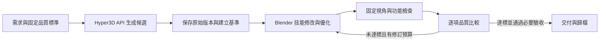

# 美術工程師的 Hyper3D API 創作流程

Hyper3D API 是美術工程師接到需求後的候選製作工具。委託者描述用途與外觀；工程師負責設計、整理輸入、選擇目前可用 API、追蹤任務、下載、後製與驗收。不要因為只收到自然語言就把委託者轉交網站。重用或修改足以達成需求時不必生成。

## 需求到創作

1. 保存需求原文，查素材庫與 master，補齊用途、風格、必要功能及交付規格；按品質流程固定標竿。低風險選擇由工程師記為 assumptions。
2. 選 `generate` 或 `split_then_generate` 後執行 `workbench.py plan <request>`。新增 `creation_workflow` 提供工程師交接清單，每件或每部件帶入造型約束、pivot 與整件規格。這是離線設計資料，不是直接傳給 API 的 payload。CLI 另在每個 job 附 `prepare_spec_draft`（只填需求路徑、未使用的 operation ID／輸出版本、Rodin 支援格式、截斷後面數與 Raw；需骨架時加 TAPose）與 `draft_notes`；tier、material、prompt、images、authorization 留空，未補齊的草稿會被 `hyper3d_api.py prepare` 拒絕。
3. 工程師撰寫單件／單部件 prompt，選取原創或已獲准上傳的參考圖。圖生 adapter 需要圖片時，由工程師準備或選用設計圖；準備工具若需付費，沿用該工具的具體授權，不能默認免費。文字生成只選當下確實提供文字接口的工具。
4. 核對可見工具 schema 與非扣點連線，再將設計轉成該 backend 的參數。不能從歷史工具名稱推定本次可用，也不能把固定 30k 候選說成已符合 1,500 面交付需求；差距進入後製計畫。
5. 沿用已有的具體預算／候選數／資料上傳授權。只有真正缺少授權才請委託者補上；「API 給美術工程師創作」指定工具用途，沒有自動設定無限花費。月訂限制依 AGENTS 與 production-runbook；API 總額不可當作月訂分項。網站可以補充額度證據，模型仍透過 API 提交。
6. 在 `runs/` 保存唯一 operation ID、需求雜湊、輸入檔雜湊、工具／参数、費用與 Authorization Envelope，完成檢查後才將 `prepared` 送到 API。`plan` 的 null prompt／operation ID 必須先補齊，不能直接提交。查歷史 operation（`workbench.py plan` 輸出的 `ledger` 區塊列出本需求既有操作與阻擋規劃的操作），禁止替 unknown／pending 另造 ID 重送。
7. 查同一任務，依工具要求退避輪詢。完成後下載到新的 `assets/raw/<id>/<version>/`，記錄任務 ID、實際扣點、檔案與 SHA-256；原 master 保留。
8. 保存下載原始檔及來源雜湊，先建立完整 baseline；再由 Blender 技能修改、優化、綁骨與製作指定動畫。每輪使用固定視角／光照、功能檢查與逐維比較；未達標且有修訂預算才修訂當前最佳版本，必要驗收通過才進入交付審查。生成完成不是交付完成。

這條流程依 [品質實驗](art-quality-loop.md) 留下需求／評估雜湊、每輪起訖時間、來源與實際交付內容。新需求可重用既有已下載候選，不必再扣點；一次生成不能提供照片中的完整骨架或連段保證。角色先檢查中性姿态、抬臂、雙手下劈與落地，再檢查整段和乾淨場景匯出回讀。按實際變形後的手指、劍柄與靴底表面量測接觸，不用由同一目標算式得出的零距離證明握持。

本 repo 的新入口見 [Hyper3D API 入口](hyper3d-api-entry.md)。2026-10-03 已完成一筆
中性設計圖→生成→DPAPI 任務恢復查詢→三檔下載的實際驗證；服務回報0.5點。
這只證明該生成操作可用，沒有證明所有接口、骨架或指定連段已通過。
按需點數使用已獲明確授權時，不重複詢問點數；repo外每筆新秘密任務檔仍依使用者
具體檔案授權與執行環境審批。不得把新入口等同放寬舊全域權限。

## 狀態與備援

### 同圖分件先驗證，僅替換有缺陷證據的部件

多個部件可以先放在一張不重疊、留有間隔的設計圖中，作一筆批量候選實驗；
不能先承諾完整性、獨立物件、動畫拓樸或整案成本。API 回傳一個 GLB 也可能
包含可分離的多件。先核對实际扣點、完整件數、幾何融合與 UV／材質，再在
Blender 分離保存來源、量測尺度與配裝。鏡射裝備要重新計入整件面數預算。

RO r005 的一次實測回傳一個 GLB，六件均存在並能分離；服務回報0.5點。
鏡射兩種裝備後，完整組裝為八網格、55,488三角面。這是該次成功的完整性
證據，不能推廣為所有多件輸入的保證。實測紀錄見
[r005 壓力測試](../runs/qa/ro-swordsman-combo-r005/README.md)。

部件存在不代表通過交付。先區分来源缺陷與配裝／骨位／權重／動作問題：
臉部在中性姿態就模糊，可以提出單件 core 來源比較；握持的骨端可達但掌指
折壓，仍需修 rig。不能把一個工程問題升級為全部部件重新生成。
保存原基準、失敗修訂、耗時與剩餘次數；輸入策略變更不重設實驗預算。

角色蒙皮前，檢查同座標 UV 接縫的幾何連通與權重一致性；可保留 UV loop
而合併真正同位置的幾何，但不得只憑 proximity 把分離表面黏在一起。
自動權重只作起點：裝備、衣片、武器控制骨不得自動影響身體；關節需要
合法骨範圍內的漸變。四個正規化權重、閉合網格及零骨端 residual 都不能
代替抬臂、深蹲、雙手握持近照與實際變形表面檢查。

乾淨回讀優先使用新的本機 Blender 程序與預設場景內的物件清理，
不要為匯入資產呼叫含偏好重設的 `bpy.ops.wm.read_factory_settings`；
本次觀察到它可能觸發 repo 外擴充依賴清理。若 importer 自動新增骨骼
顯示用幾何，要以內建 source 與物件用途核對，或使用受支援的
`disable_bone_shape=True`，不能把輔助物件計入角色預算。
靜態骨架回讀與真正動畫 channels／全段採樣的驗收分開記錄。

當實物預檢發現融合肢體、遮蔽部位或關節結構需要大幅重建，且修訂成本超出剩餘預算，依需求轉為「先產生清楚設計圖 → Hyper3D 新候選 → Blender 細節修整、骨架與動畫」。先保留失敗的 master、檢查與已耗資源；新路線經使用者指定後，另存需求版本與新原始基準，沿用原品質門檻，不抹掉舊輪次。一般關鍵幀路徑、握持或碰撞問題仍要在動畫中修正，重新生成形體不會自動修好動作。

按差距選 API：造型使用圖生／可用的文生，融合部位可評估拆件，純材質可評估 texture-only。官方有功能不代表當前 adapter 或帳戶已可用；先核對可見 schema、當前連線及成本。不可用的分支保持未驗，不改全域設定強行補齊。`reconstruction_policy`／modify 的 `reconstruction_fallback` 只提供離線交接，不會提交、扣點或重置預算。

分開報告 `capability_state`（可否呼叫）、`input_state`（輸入是否備齊）、`credit_pool_state`（能否證明允許的點數來源）、`authorization_state`（是否有具體花費範圍）及 `execution_state`（任務狀態）。離線 plan 全部保持待查，`submission_ready: false`，不聲稱探測或授權已完成。這些欄位是協調交接，沒有實作交易鎖或 API 執行器。

| 實際情況 | 工程師下一步 |
| --- | --- |
| 本次看不到 API 工具 | 回報工具載入缺口，保存設計與輸入；不推定 key 無效 |
| API 認證成功但只有總餘額 | 回報月訂分項待確認；有可用官方帳戶頁時補查，不重設憑證 |
| 圖生工具缺圖片 | 準備設計圖或查可用文字接口；不宣稱服務只能網站生成 |
| 參數或輸出格式不符 | 評估後製／格式轉換；不能靜默降低交付規格 |
| submission unknown／pending | 查原任務與原 operation；禁止重送或轉網站新建 |
| 下載路徑被拒 | 保留完成任務，依既有授權查安全下載路徑或網站下載；不重新生成 |

網站生成不是預設入口。只有 API 的具體阻礙經查證、使用者既有範圍允許且不存在未釐清提交時，才記錄理由、費用與差異後採網站備援；備援不能擴張預算。全域憑證沿用受支援提供者，不複製到 repo、不修改全域權限。

## 本次能力證據的限制

2026-10-02 初始連線檢查只驗證 `hyper3d_api` 認證与 balance，不能代替扣點／下載。其後本任務在使用者明確允許一件0.5點現有月訂或普通額度後，完成 `ro-swordsman-reference-20261002-001`，保留 raw GLB、下載hash與費用紀錄於 `assets/raw/ro-swordsman-combo/rodin-v001/manifest.json`；這是該筆操作證據，不擴張預設月訂政策，也不授權下一筆。第二階段 `requests/ro-swordsman-combo-r002.json` 重用該 raw，所有後製本機執行；commit／push 明確等待使用者驗證。每次新提交仍查當前工具。官方接口與工具封裝的差異見 [Hyper3D adapter](hyper3d.md)。
