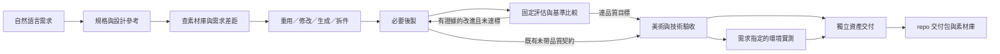

# 需求驅動的美術工程工作流

本 repo 是美術工程師的工作台：以交付需求為中心管理設計、製作、驗收與可重用資產。客戶和製作工具可替換，完成條件由需求決定。首批兩款遊戲保留在選用客戶規格與歷史清單，不構成核心的專案限制。



環境實測只有指定 `target_environment` 時才需要；圖中的兩條交付路徑由需求決定。任何檢查失敗或未做都要留下缺口，不能跳成通過。

## 需求與預設

`scripts/workbench.py intake` 接收原文、ID、任務類型及選用 profile，只輸出草稿，不默默寫檔、不自動推斷完整規格。協調者保存到 `requests/<id>.json`，讀取原文與參考後整理：

| 欄位 | 用途 |
| --- | --- |
| `brief`／`purpose`／`provenance` | 原始需求、使用場景與來源；可來自人類委託，不必有遊戲 Git HEAD |
| `task_type`／選用 `project` | 資產行為與客戶設定，project 可省略／null／新增 slug |
| `style` | 風格、參考、必須／禁止元素 |
| `spec` | 尺寸、公尺／軸向、面數、貼圖、部件 pivot／動作、骨架與動畫 |
| `production` | 路徑、理由、重用候選及修訂上限 |
| 選用 `quality` | 固定標竿、評分錨點、比較條件與時間上限；新製作／品質修訂由美術工程師補齊 |
| `delivery` | 指定格式、standalone 或明確環境的版本與實測情境 |
| `additional_checks` | 需求指定 LOD、穿插、掛點等額外檢查，不能覆寫基本檢查 |
| `assumptions`／`open_questions` | 可修訂預設與真正需要補齊的缺項 |

`status: draft` 可合法記錄未知尺寸／面數；`validate` 只檢查結構，`plan` 的 pending 仍會指出缺項。補齊後改為 `specified`，不表示已核准付費或驗收通過。無貼圖需求可用 `texture_px: null`；有貼圖則用正整數，非固定只有 1K／2K。

可先採公尺、+Y 上、+Z 前、GLB 獨立交付，明確記成可改預設。影響玩法、可動結構、角色骨架、精確接合或最終交付的缺項需先解決。範例文件只是示範；不以它們發起生成。

## 製作選擇與工具

先搜 `library/index.json` 並查看實際檔案、版本、QA 和未解問題。搜尋是文字 metadata 比對，不是自動形狀相似度。相符就重用；小差距修改衍生版本；主要輪廓不符才重估生成；可互動或組合資產先拆件。有 `quality` 的需求，`compare` 從紀錄核對修訂次數與時間；沒有品質紀錄的舊需求仍只保存修訂上限。工具不控制 DCC 或付費提交，不能把事後核對宣稱為執行時強制停止。

新製作及品質修訂採 [品質實驗流程](art-quality-loop.md)：凍結用途與標竿、建立 baseline、每輪一個假設、同條件比較、保留有證據的改進。各項目標與適用功能／技術門檻分開；任何品質維度退步都不能靠其他高分抵銷。需求的 `quality` 仍是選用擴充，以保持舊需求相容；美術工程師處理新品質任務時負責補齊。

`tools/capabilities.json` 是能力登記，不是插件執行器或授權。核心計畫描述「候選生成、模型編輯、格式輸出」，協調者才選目前可用工具。Hyper3D 操作及月訂範圍依 [製作流程](production-runbook.md)；Blender 等未驗能力保持未驗，不宣稱一鍵產製。

`catalog/assets.json` 保留首批批量候選。原 repo source 的 path／line／head 仍須完整；新清單可用 brief／reference／library 類型來源。專案 ID 不再限制兩款遊戲；`pipeline plan --project standalone` 可篩選 project null。未知、缺少操作狀態會停止規劃，失敗／取消也不自動釋出成可重送。

`generate`／`split_then_generate` 的 `plan.creation_workflow` 是美術工程師的 API 輸入設計交接。API 下載後依 [API 創作流程](api-creation-workflow.md) 保存原始、建立完整基準、用 Blender 技能後製、固定視角及功能檢查，再逐維比較；每輪保留真实時間、失敗及內容雜湊。範圍仍由本次需求與已給定授權決定。

大幅重建可依使用者指定改走設計圖 → Hyper3D → Blender 細修；保留原失敗版本與資源紀錄，另建原始基準。`modify` 的 `reconstruction_fallback` 與生成計畫的 `reconstruction_policy` 都不提供扣點許可；按需求核對當前可用的形體／拆件／材質 API，骨架與連段保持獨立驗收。

對反覆失敗的局部功能，先拆開來源形體、面流、骨位／軸向、權重、配裝、材質轉移與
驗收方法等原因，修正已觀測的方法錯誤再評價來源。選最小可替換部件做實體原型；
先冻结局部姿勢、相機、接觸面與容許值，與完整品質契約以雜湊一起保存。
原型先過用途關卡，才擴展對稱件、全角色與連段。局部關卡不代替完整需求驗收。

成本比較同時看API服務回報、Blender修整／重拓樸工作、固定檢查、重工與產物可重用性。
生成一張圖或取得Quad模型不能預先算作節省製作成本；下載後的實體檢查才決定後製路線。
保留時鐘範圍、未量測時間與每次搜尋／回讀的事件；新授權階段另立帳，歷史累計不被清空。
下載來源先量測實際面數、拓樸與內外層；API要求Quad或target面數不等於實物符合。
接觸優化先滿足所有必要關卡，再比較候選；只最小化穿入會把武器推遠，造成沒有握住。
每個指墊遮罩要有合法且不重複的頂點，切除部位時保存穩定來源身分與新舊索引，
逐角回讀保護區UV、Basis、shape及骨權重。不能只雜湊原資料就宣稱新網格相同。

手套、腕管、核心前臂與剛性護腕分開檢查；接縫距為零仍可能有鼓包、內襯自交或
重複衣甲。切口先辨識實際邊界環及內外層，按邊連通配對，不能假定只有單環。
剛性件經Boolean／減面後重驗所有新頂點；需要時明確恢復原骨1.0權重，核對rest形狀、
五個中間姿勢及實際剛性預測殘差，不能以工具成功套用推定變形正確。

2026-10-03的r006實測已經由API取得一個手套來源，服務回報0.5點；右手完全握持端點的接觸
子關卡通過，腕部／整件品質仍有失敗。這是局部功能證據，尚無最佳工作流或完整
角色交付結論；逐輪失敗、原時鐘及未驗範圍見`runs/qa/ro-swordsman-combo-r006/`。

局部原型也須重新播放保存的 baked clip，逐幀量測實際表面與變形，標明持劍區間的
接觸要求；張掌／接近階段不必接觸，但不得穿過武器。必要時另做幀間樣本與近照，
離散零值不能宣稱連續碰撞自由。r007實測同一失敗來源後發現，r006端點接觸通過
不能外推至整段61幀；更正另存，不改寫既有閉合實驗或以新測法宣稱幾何改善。

## 按用途驗收

| 類型 | 基本美術／技術／交付之外的檢查 |
| --- | --- |
| `static_prop` | 沒有強制角色骨架或引擎門檻 |
| `interactive_prop` | 至少兩部件、pivot、活動方式／範圍、活動測試 |
| `modular_environment` | 接合邊與重用規格實測 |
| `rigged_character` | 骨架／權重／掛點及關節變形，需求列動畫時再檢查動畫 |

每件都有造型符合度、尺寸／pivot、幾何／指定材質、交付完整性。LOD 及其他要求明確放入 additional_checks；`target_environment` 需 name、version、verification_context 及該環境證據。

`plan` 回傳 `request_sha256`（Request digest，見 [CONTEXT.md](../CONTEXT.md)），以排序鍵、UTF-8、無多餘空白的 JSON 計算規格雜湊；需求改變後舊證據不再相符。需求、證據與 ledger JSON 不得有重複鍵或 NaN／Infinity；證據內 `path` 須為 repo 相對 POSIX 路徑（不接受絕對路徑或反斜線），重新 clone 後才能核對。`plan` CLI 輸出 `evidence_skeleton`（實際 request ID／雜湊、每個 `required_checks` 預設 `not_run`；有 `quality` 時另附 `quality_ledger_skeleton`），可直接存檔後填寫；骨架本身永遠不會通過 `assess`。證據格式參考 `templates/acceptance-evidence.json`：每項 `pass` 必須記方法及至少一份存在的檔案／SHA-256；未做是 `not_run`，失敗是 `fail`。輸出格式必須有相符交付檔。

```powershell
python -B scripts/workbench.py plan requests/examples/standalone-stone.json
python -B scripts/workbench.py assess requests/examples/standalone-stone.json --evidence templates/acceptance-evidence.json
```

未填模板必然得到 `not_ready`，此命令不是產出真實驗收證據。CLI 退出 0 表示核對正常執行，應查看 decision／blockers，不能把退出碼當素材 PASS。合格申報得到 `eligible_for_delivery_review`：只是進入交付審查，沒有自動 `delivered`／`game_ready`。

證據內容仍由實際檢查者負責；SHA-256 只能證明內容一致，不能證明造型正確、物理尺寸或效能。工具只讀 repo 內的 assets、deliveries、runs/qa、runs/evidence 檔案，拒絕跳出 repo 及設定／憑證區。它不自動解析 glTF／OBJ 依賴圖；依賴需在交付列表登記並實際驗證引用。

## 交付與工程師資產

有 `quality` 的需求在交付證據附 `quality_ledger: {path, sha256}`。`assess` 會重算最佳版本，核對全部維度目標、原有適用驗收，以及交付模型／已登記相依素材的內容一致性。缺少紀錄、未達標、預算違反或交付內容不同都維持 `not_ready`；仍須實際美術與交付審查。

按 `deliveries/README.md` 保存交付包與 manifest，實際審查後才在素材庫登記 `delivered` 及完成範圍。獨立資產可以完成交付，同時保持目標環境 `not_requested`；如後續要求 Unity，另開目標版本任務並驗證。

master、衍生版本和交付包均隨 repo，透過 Git／LFS 保存；保留用途、來源、工具／參數、版本、檔案／雜湊、預覽、已驗／未驗及重用條件。不得只保存 Hyper3D 雲端網址。詳見 [資產保存規範](asset-storage.md)。

本次工具不會自動下載、修改模型、複製交付檔、更新索引或執行 Git；這些由協調者在已授權範圍內完成。目前素材庫兩件仍 `needs_revision`，沒有新的已交付資產。
