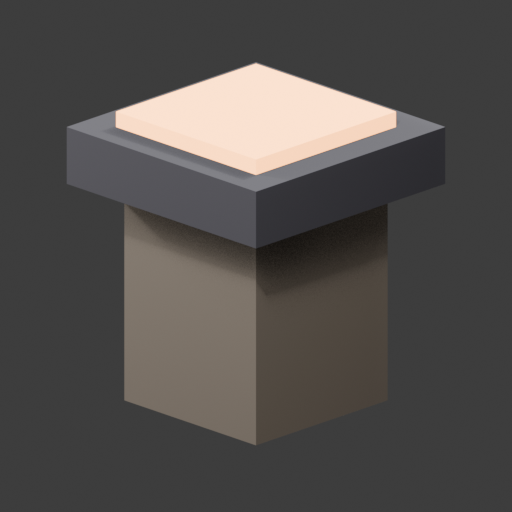
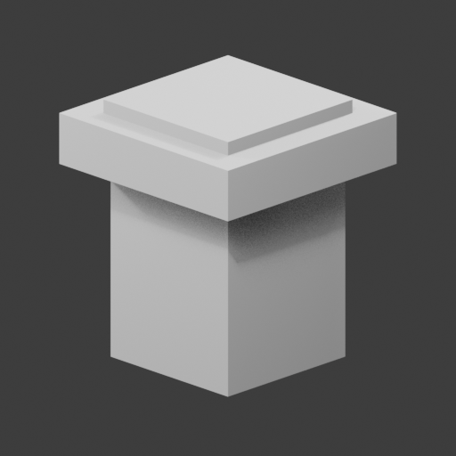

# 美術工具本機增補與驗證 — 2026-10-07

**已完成本機能力增補與當次可執行驗證。** 這次交付是工具與來源／預覽入口；尚未完成新的高品質角色、官方 GLB 結構驗收或完整 runtime／P5。

依使用者選擇「接續實作指定項目，完成相關驗證」，讀原交接三文件及後補的 `art-engineer-upgrade-20261007.zip`。先在 `tmp/art-tools-upgrade-20261007`（detached `1ae4f330…`）實作、回歸、獨立覆核，再將已驗內容導入目前 repo。沒有 stage／commit／push／PR／merge。

## 結果

| 關卡 | 本次結果 |
|---|---|
| 本機導入 | 13 新檔＋AGENTS／skill 兩份末尾追加，15 檔逐一回讀與已驗 worktree 一致；保留原文前綴 |
| 完整回歸 | main 實跑 306／306 通過、0 failed、0 skipped，exit 0；原包在 Windows 的 component 56＋installer 14 也通過 |
| catalog／operation | `pipeline validate` exit 0：39 件 catalog 資產、11 筆 operation；只驗格式、連結與證據，不代表 runtime |
| 工具可用 | Python 3.12.7、Node v22.22.0、Blender 4.5.5 LTS；已查位置沒有 retarget addon／本機官方 validator |
| DCC 實測 | 隔離 worktree 真實 Blender 擷取兩視角 × beauty／clay，四張 512×512 PNG，exit 0；來源／protocol／script／圖片 SHA 回讀相符 |
| 官方 validator | wrapper 實際回 `not_run / KHRONOS_VALIDATOR_UNAVAILABLE`，exit 3；没有安裝依賴，不算通過 |
| 美術／runtime | 未新增美術評分或 runtime 執行；保留既有 P4 皺褶／高速失敗與 closed-loop gate 失敗，P5 未開始 |
| 授權／远端保存 | 沒有新 trial、付費、來源匯入、全域安裝或遠端寫入；實際花費 0；目前僅本機未提交檔 |

## 主要變更與理由

- `scripts/art_sources.py`、`tools/art-sources/catalog.json`：來源收據、公開 raw 權利檢查及明確 `--apply` 的新版本本機匯入。收據記錄審查宣告，不替代真實授權；本次沒有匯入外部素材。
- `scripts/blender_art_preview.py`：沿凍結相機／照明，產生中性靜態 beauty／clay。補強 `extensionsUsed`、`extensionsRequired` 及巢狀 extension 鍵的 allowlist／宣告一致性。
- `tools/art-validation/validate-glb.mjs`：沿真正 Khronos `validateBytes` API 入口，缺少依賴就 not_run。補強只載入專用本機套件，拒絕 ancestor／NODE_PATH、symlink、父層／sibling 與 Windows 跨磁碟入口。
- 三份新 tests、三份草稿模板、製作增補與來源研究文件；七項新回歸覆蓋上述缺口。既有 `workbench.py` schema、request digest、quality ledger、角色來源、cv1 轉場／腳鎖、Three.js package 沒有修改。

原 ZIP／manifest 保持不變，SHA-256 `1a157c0448b660c784f5c07acd7d138540ef72028436364324b3bcdbfac69cf0`。manifest guards 雖以 `08c454e6…` 為基線，仍與目前 `identity.py`／`workbench.py` 相符。四個 helper/tests 為本次經覆核的衍生補強，最終 SHA 見 `installed-files.json`；原包重複套用會對這些衍生差異停止，不應修改 manifest 假裝相同。

## 首份可檢視比較證據

使用既有本機程序建模的 `deliveries/cl-barracks-set-v1/v1/cl-brazier.glb`（4,396 bytes、SHA `a31c49de…91daf`），未重新生成或建立來源收據。Beauty 可看石座、鐵盆與發光炭火材質；clay 可看相同幾何。這是工具 smoke，沒有把既有火盆升格為新的美術交付。

| Beauty | Clay |
|---|---|
|  |  |

第二視角為 `beauty-01.png`／`clay-01.png`。DCC 只在隔離 worktree 執行一次成功擷取；此資料夾保存回讀一致的副本，沒有冒稱在 main 再執行。來源沒有貼圖，這次沒有驗證 UV／貼圖取樣、動畫或變形。

## 步態接續條件

`motion-baseline-plan.json` 保存唯讀路線：A 採 Walk a04 on b20-coatlie3；B 尚未選取。必須先對帳跨版 clock、候選身分與當前 trial 授權，再用權利明確的既有 motion 或原 clip 的授权修訂，固定條件比較承重、腳底滾動、身體相位、起停與步幅／速度。保留 target rig/rest/mesh/weights 與 cv1 gates。

現有 `p4/milestone-04-progress.json` 記錄 126/191 情境通過；歷史背景 runtime 116/118 blocks 通過，最大 18.731 µm 超過 10 µm。D2/G1/H1 未改判。`v001-pause-31.json` 與後續封存授權仍需對帳，不能宣稱其快照差額是目前剩餘預算。P5 不在當前記錄的授權範圍，未凍結、未執行。

## 驗證、安全與限制

實跑結果在 `verification.json`、`main-unittest.log`、`main-validate.log`、`kit-reproduction.log`、`blender-smoke.log`、`official-validator.json`、`capture-v001/capture.json`。獨立 security review 接受最終 helper，原 Medium 與跨磁碟缺口已修；模型覆核不是人類授權或素材接受。

sandbox Git ownership 與 `orchestrator_helper_incomplete` 是環境阻礙。依獨立架構覆核，只對完整已審 Blender 命令做一次受審查的 host 重試；保留 factory/background/disable-autoexec。沒有改 safe.directory、ACL、sandbox、全域設定，也沒有動使用者既有 Blender process。原 installer 的 Low 回復回報限制保留於原包，installer 沒有納入本次 repo 交付。

若要補官方 GLB 驗證，需要另具體核對本機依賴安裝範圍、官方來源、版本與 lockfile。若要新步態／P5，需先補對帳與階段授權。這些門檻保持未執行，不以本次測試通過抵銷。

本次本機增補範圍已完成，無待決定事項。目前沒有本任務背景工作繼續執行；隔離 worktree 保留作追溯。遠端保存未執行。
