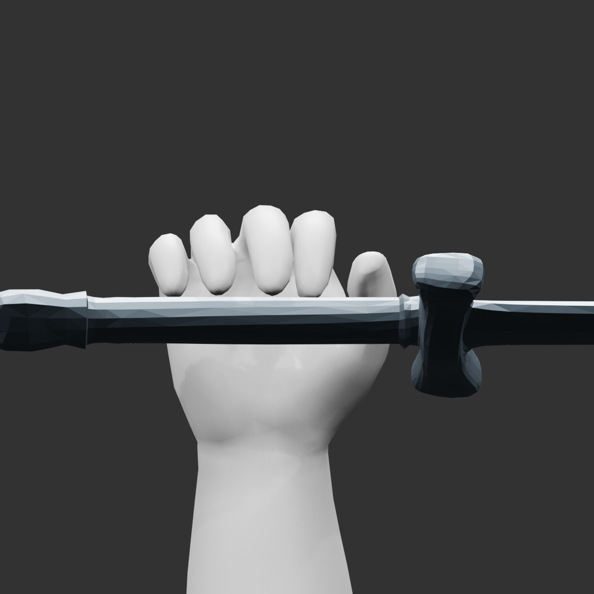
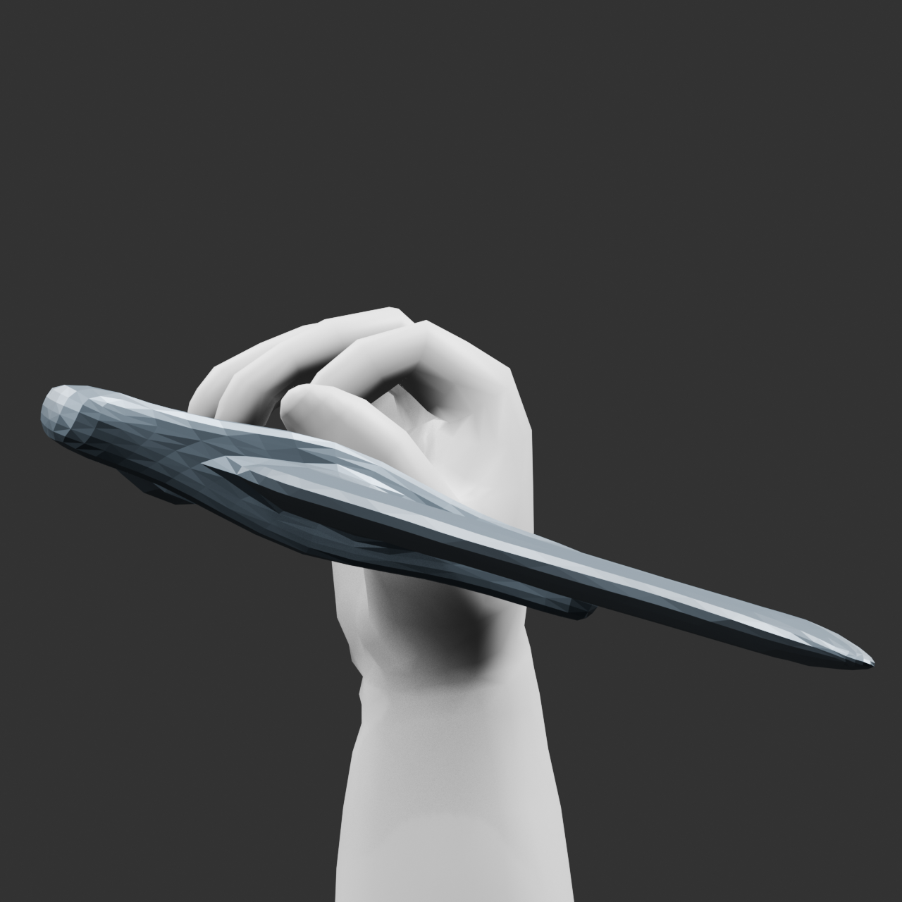

# RO 劍士 r008：方向1的四候選壓力測試

狀態：**NO-SHIP／not_ready／stop_budget**。四候選已封存；局部手與拇指小動作有改善，
完整RO角色、骨架與300幀／60fps連續技能仍未完成。全部舊任務、來源、失敗與成本
保留；本輪沒有付費提交、扣點、stage、commit或push。

開始UTC `2026-10-03T13:48:14+00:00`。封存时phase wall為3968.465451秒（66.1分鐘），
包含準備、規劃、等待、審查與驗證；首次讀取6.1秒在時計觀測前另記，精確最早起點
未觀測，不捏造時間。封存後的文件／驗證時間另見`final-verification.json`。

| 候選 | 方法與目的 | 實測結果 |
| --- | --- | --- |
| v001 | 完整hand→thumb01→thumb02→thumb03向量，解除前輪錯誤遠端凍結 | 屈曲方向通過；CMC長軸旋轉方向與固定期待相反，保留失敗 |
| v002 | 只修正CMC旋轉方向，保持網格／UV／權重／骨位 | 23隔離姿勢、8方向與3小幅聯合診斷支持受測局部改善；大幅自交0／23／42，FAIL |
| v003 | 各指独立屈曲、有限MCP展指，從真實來源劍開始驗證 | 6固定握持例仍有自交及326–465組手—劍交叉，約10mm穿入；近pad不代表握住 |
| v004 | 有界碰撞與固定pad接觸求解、展指先於屈曲、單一剛性握位 | 完成383次實測；無交叉保存端點仍缺無名指／食指接觸，FAIL |

相同.30rad近端聯合curl、係數1／1.4／.85的最大絕對邊長變化，原局部baseline
13.992mm，修訂後5.390mm。這是同條件局部數值改善，不是完整角色品質或體積PASS；
實際MCP為.42rad。全角色6維品質維持`3／3／2／3／1／0`，目標仍各4，沒有用局部
手成果抬高分數、以總分抵銷缺陷或更換已接受master。

最後端點的新Blender重開結果：手內橫向交叉0、手—劍橫向交叉0、unknown parity0、
sample最大穿入0；但固定pad每指必須至少3個距柄<=2mm的點，實際為小指3、無名指1、
中指3、食指0、拇指4。無名指／食指第三近點距3.618／5.695mm，仍不可交付。

這些圖是局部手與實際劍的診斷圖，劍在側面延伸超出局部相機，不是完整角色預覽。
可開啟`../../../assets/processed/ro-swordsman-combo-r008/v004-contact-solver/right_hand_actual_sword_best.blend`
檢查；其名稱best只是本輪搜尋選定樣本，**不是交付PASS**。

VERIFIED：來源點／面／每角UV／source attributes一致；203點完整拇指domain及25點
rigid cap；600固定解算步，100步最大更新約8.4953e-11，600步0；寫入最大浮點／截斷差
2.97631e-8。新程序重開確認保存手的geometry／UV／weights、16原骨head/tail，以及
未縮放真實劍的三角與單一剛性平移，重現接觸失敗。119項unittest通過；pipeline39筆
清單schema通過，不包含來源新鮮度或runtime驗收。

限制：早期L1／L2只含拇指四分量，後續全骨邊界補查揭露8個外側點有四指骨權重；
投影為hand1只在四指靜止時近似。由polygon邊取截線和凸包僅作診斷，不是非平面quad
的精確loop-triangle輪廓或局部體積驗收。橫向交叉與有限inside樣本排除共面／相切／
鄰接折疊，零不等於完整沒有缺陷。383次coordinate搜尋不是全域不可解的證明。

16跨UV島面仍FAIL；功能未過，所以未做最終UV rebake、握持過程、左手／衣甲配裝、
300幀技能、独立VFX或新完整動畫GLB。素材庫只記`needs_revision`與`not_delivered`。
目前runtime的default命令探測為`ENVIRONMENT_FAILURE: sandbox provisioning failed`；
完整、逐條審批的限定命令執行成功，未更改sandbox、ACL、hook、API全域設定或憑證。

主要證據：`quality-ledger.json`、`comparison-final.json`、`assessment-final.json`、
`phase-accounting-final.json`、`fresh-saved-verification.json`、`v004-contact-solver/evaluations.jsonl`。
`next-method-proposal.json`只是未執行草稿，建議先診斷並校準必要四指骨架／掌根過渡
與真正握持，再決定必要局部拓樸；若需要大幅改形，沿原定圖片→Hyper3D→Blender路線。
不自動開第五候選、不清空舊時計、也不以再次生成代替動畫驗收。commit、push继续待人
驗證成果。沒有API或Blender背景工作繼續執行。
