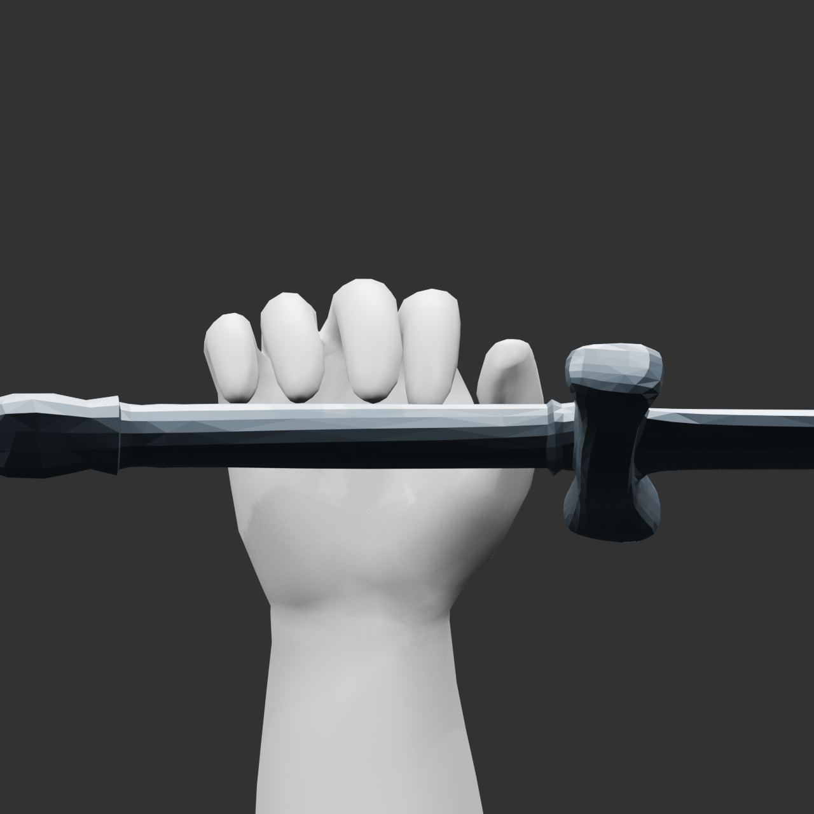
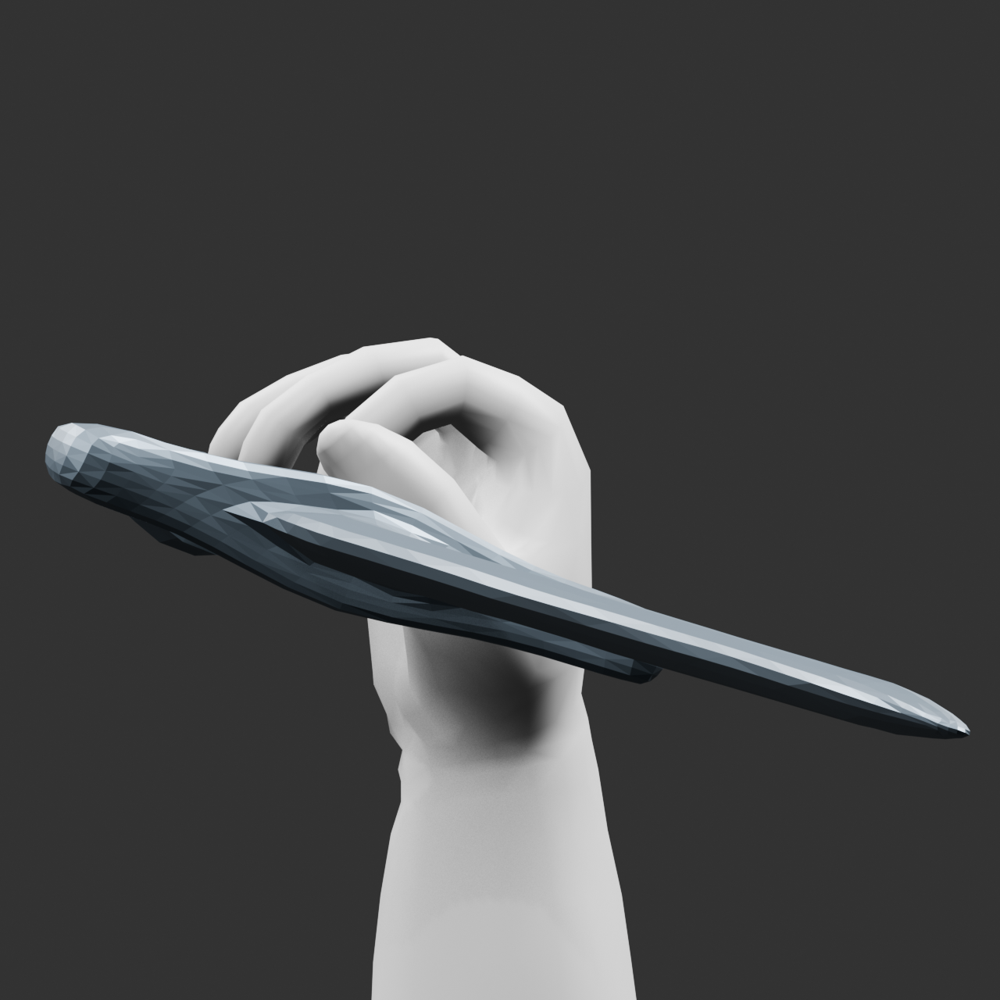

# RO劍士 r009：全手校準壓力測試

**NO-SHIP／not_ready／stop_budget 4/4**。本輪保留可重用的掌根權重改善，完整握持、角色
與300幀／60fps連續技能仍未交付。commit／push待人驗證，沒有新增API提交／扣點。

使用者授權：「方向1：開始全手校準的新階段，保留歷史，commit／push 繼續等我驗證。」
本輪首次UTC觀測 `2026-10-04T01:28:58+00:00`；此前準備讀取未精確量測，明列缺口。
四候選封存phase wall1837.115223秒（30.6分鐘），含準備／審查／等待／驗證；封存後
文件時間另記。r008全部183檔案雜湊維持，舊時鐘及失敗不清空。

| 候選 | 方法 | 實測結果 |
| --- | --- | --- |
| v001 | 同時解四指完整向量，掌根/web合法支援域 | 同姿勢277–278長0.594→5.179mm；minratio .0666→.34475；24正向隔離無受測cross，接觸仍未過 |
| v002 | 耦合有限差分IK | 83探測，11完整功能檢查；三平移導數失效，TEST_FAILURE保留，接觸未過 |
| v003 | 修正移動target座標，正負xyz自檢 | 36探測，5完整功能檢查；導數通過，接近提案仍6–50組劍交叉 |
| v004 | 接觸步加入近表面碰撞半空間 | 86探測，7完整功能檢查；保存零受測cross，但接觸3/1/3/0/3，FAIL |

共205解算探測只有23個做完整功能關卡；182個導數／基準／自檢未做碰撞檢查。
v001另外24個正向.05/.30姿勢，補驗8個MCP/PIP姿勢；不宣稱已驗負向伸展。
projection600固定步，最大更新約2.22e-16；469點域、cap20/19/22/25、203拇指保護。
未分類點明示角色；不逐指覆蓋hand、不讓鄰指遠端骨污染。鄰指本體最大位移約3.07e-8m。

最後五指每指必須>=3個距柄<=2mm的固定pad點；實測小指3、無名指1、中指3、食指0、
拇指3。零橫向自交／劍交叉、有限inside最大穿入0、unknown0，不能抵銷缺指。
v004minratio約.3784，為未觸發保守stop，不是形體／體積PASS。

圖是局部診斷，劍在側面可超出相機；不能替完整角色五視角或動畫。
模型：`../../../assets/processed/ro-swordsman-combo-r009/v004-collision-constraints/right_hand_collision_constrained_contact.blend`。

VERIFIED：新Blender程序重開904個同ID點做最大／RMS差，1e-6m容差通過；原geometry／
UV／來源ID、v001權重、203拇指點、原16骨位與未縮放真實劍維持。122項unittest通過。
工具測試、schema／hash與實物功能分開，沒有把工具PASS算成模型PASS。

限制：橫向交叉與有限inside排除共面／相切／鄰接折疊；碰撞代理最多96樣本且局部
線性化，不是完整碰撞。射線／被表面遮蔽的內部骨線不能確診解剖；沒有搬骨或改mesh。
v004有真實無交叉提案可降低總gap、卻因最大gap小幅退步而不被lex目標接受，這是方法
停滯，不是全域不可達。沒有為了過關更換pad、縮窄劍、降低門檻或提高完整quality分。

16跨UV島面仍FAIL；完整握持端點未過，所以未做interval跟隨、UV rebake、左手／衣甲、
300幀技能／VFX／新動畫GLB。assess沿用明確失敗完整baseline，局部原型未登accepted。
本輪default命令因 `sandbox provisioning failed` 無法啟動；限定逐條審批命令成功，
未更動sandbox、ACL、hooks、API全域或憑證。repo外寫入0。

主要證據：`local-contract.json`、各候選result/evaluations、`fresh-saved-verification.json`、
`quality-ledger.json`、`comparison-final.json`、`assessment-final.json`、`phase-accounting-final.json`。
`planning-review.md`是獨立審查摘錄（不是完整逐字報告）；最終獨立審查另存。
`next-method-proposal.json`只是未執行草稿；下一方法由實際語義接觸／控制／形體診斷決定，
需要大幅重建仍按圖片→Hyper3D→Blender。沒有第五候選或背景產製繼續執行。
